# spring-tutorial-23rd : CEOS 백엔드 23기 스프링 튜토리얼

<details>
<summary><h2> 1️⃣ spring-tutorial-23rd를 완료해요!</summary>

### 1. Spring Initializr
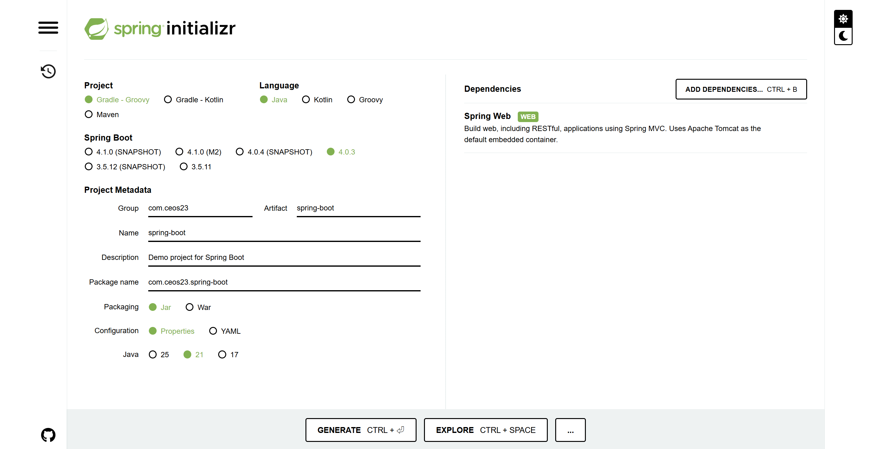


**1-1. Application 실행**
```
# Spring Boot 애플리케이션 실행
# Gradle Wrapper(gradlew)를 사용하여 프로젝트를 빌드하고 서버를 실행한다.
# 실행 시 다음 과정이 자동으로 진행된다.
# 1. 프로젝트 의존성 다운로드
# 2. Java 코드 컴파일
# 3. Spring Boot 애플리케이션 실행 (기본 포트: 8080)

./gradlew bootRun
```
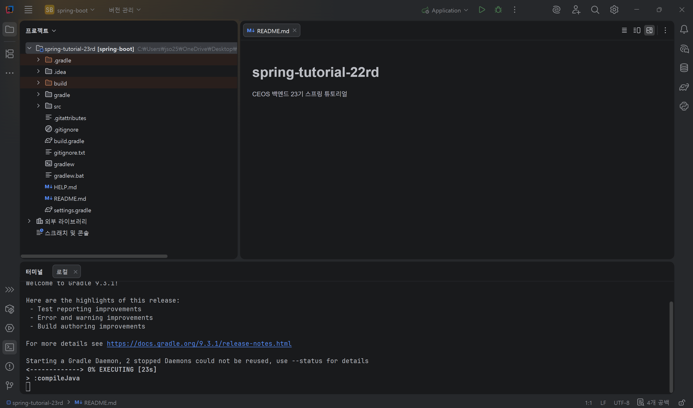


**1-2. 서버 작동 확인**
```
curl localhost:8080
```
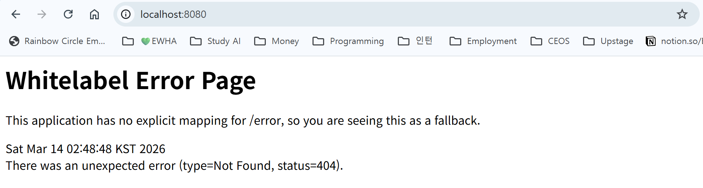

---

### 2. 간단한 Web Application

**2-1. 간단한 controller**
* 경로 : `\src\main\java\com\ceos23\spring_boot\HelloController.java`

```
// HelloController.java

// 패키지 선언
// 이 클래스가 속한 패키지를 의미한다.
// 보통 프로젝트 구조(src/main/java 아래 폴더 구조)와 동일하게 설정된다.
package com.ceos23.spring_boot;

// Spring에서 HTTP 요청을 처리하기 위해 사용하는 어노테이션 import
import org.springframework.web.bind.annotation.GetMapping;
import org.springframework.web.bind.annotation.RestController;

// @RestController
// 이 클래스가 REST API를 처리하는 Controller임을 의미한다.
// Spring이 해당 클래스를 자동으로 Controller Bean으로 등록한다.
// 또한 반환값을 JSON이나 문자열 형태로 바로 HTTP Response에 전달한다.
@RestController
public class HelloController {

    // @GetMapping("/")
    // HTTP GET 요청이 "/" 경로로 들어왔을 때
    // 아래 hello() 메서드를 실행하도록 매핑한다.
    // 즉 브라우저에서 http://localhost:8080 접속 시 실행된다.
    @GetMapping("/")
    public String hello() {

        // 클라이언트(브라우저)에게 반환할 문자열
        // REST API에서는 이 값이 HTTP Response Body로 전달된다.
        return "Hello, Spring Boot!";
    }
}
```

- 가장 기본적인 Spring Boot REST API 예제
- @RestController → REST API 컨트롤러 선언
- @GetMapping("/") → GET 요청 URL 매핑
- return → HTTP 응답 데이터 반환

.png)
.png)

**2-2. Application class 수정**
* 경로 : `src/main/java/com/ceos23/spring_boot/Application.java`

```
// 패키지 선언
// 이 클래스가 속한 패키지를 의미하며 프로젝트 폴더 구조와 연결된다.
package com.ceos23.spring_boot;

// Spring Boot 애플리케이션 실행에 필요한 클래스 import
import org.springframework.boot.CommandLineRunner;
import org.springframework.boot.SpringApplication;
import org.springframework.boot.autoconfigure.SpringBootApplication;

// Spring의 ApplicationContext (Spring 컨테이너)
// Bean들이 저장되고 관리되는 공간이다.
import org.springframework.context.ApplicationContext;
import org.springframework.context.annotation.Bean;

import java.util.Arrays;

// @SpringBootApplication
// Spring Boot 애플리케이션의 시작 클래스에 붙이는 어노테이션
// 아래 3개의 기능을 포함한다.
// 1. @Configuration : 설정 클래스 역할
// 2. @EnableAutoConfiguration : Spring Boot 자동 설정 활성화
// 3. @ComponentScan : 현재 패키지 하위의 Bean 자동 탐색
@SpringBootApplication
public class Application {

	// 프로그램의 시작점 (Java main 메서드)
	public static void main(String[] args) {

		// Spring Boot 애플리케이션 실행
		// 내부적으로 Spring 컨테이너(ApplicationContext)를 생성하고
		// Bean들을 등록하고 서버를 시작한다.
		SpringApplication.run(Application.class, args);
	}

	// @Bean
	// Spring 컨테이너에 Bean 객체를 등록하는 어노테이션
	@Bean
	public CommandLineRunner commandLineRunner(ApplicationContext ctx) {

		// CommandLineRunner
		// Spring Boot 애플리케이션이 시작된 후 실행되는 코드
		return args -> {

			System.out.println("Let's inspect the beans provided by Spring Boot:");

			// Spring Boot가 생성한 모든 Bean 이름을 가져옴
			String[] beanNames = ctx.getBeanDefinitionNames();

			// Bean 이름을 알파벳 순으로 정렬
			Arrays.sort(beanNames);

			// 모든 Bean 이름 출력
			for (String beanName : beanNames) {
				System.out.println(beanName);
			}

		};
	}

}

```

- Spring Boot 실행 시 (./gradlew bootRun)
    - Spring 컨테이너 생성
    - 자동 설정 수행
    - Bean 생성
    - 애플리케이션 시작
    - CommandLineRunner 실행

- **핵심 개념 3가지**
    1. SpringApplication.run()
        → Spring Boot 애플리케이션 실행
    
    2. ApplicationContext
        → Spring이 Bean을 관리하는 컨테이너
    
    3. CommandLineRunner
        → 애플리케이션 시작 후 실행되는 코드

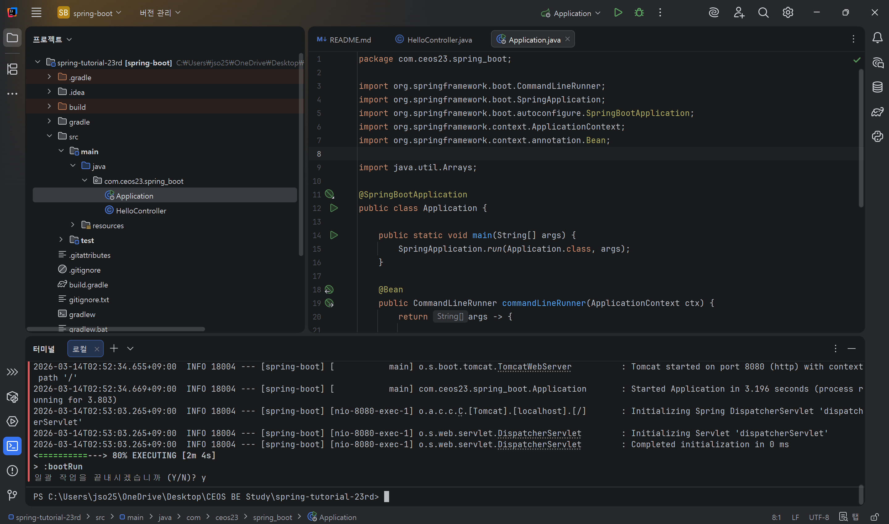

**2-3. 결과 확인**
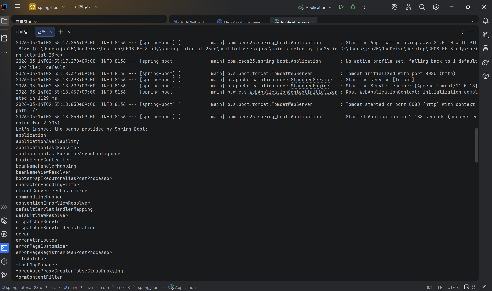
- Spring Boot가 자동으로 생성한 Bean 목록을 확인하는 예제 코드

- Bean 확인
    - *직접 만든 Bean*
        - *application*
            - `Application.java` 클래스 자체
            - `@SpringBootApplication` 때문에 스프링이 시작 Bean으로 등록
        - *commandLineRunner*
            - `Application.java`에서 `@Bean`으로 만든 메서드
            - 프로그램 시작 시 실행되는 코드
        - *helloController*
            - `HelloController` 클래스
            - `@RestController` 때문에 자동 Bean 등록
            - `/` 요청을 처리하는 컨트롤러

    - *웹 요청 처리를 담당하는 핵심 Bean (Spring MVC 핵심)*
        - 웹 서버가 동작하기 위해 **Spring MVC가 자동 생성한 핵심 Bean들**
        - *dispatcherServlet*
            - 모든 HTTP 요청을 받는 중앙 컨트롤러
            - 스프링 MVC의 핵심
        - *requestMappingHandlerMapping*
            - URL → 어떤 Controller 메서드인지 매핑
        - *requestMappingHandlerAdapter*
            - 매핑된 Controller 메서드를 실제 실행
        - *handlerExceptionResolver*
            - 요청 처리 중 발생한 예외 처리
        - *viewResolver*
            - Controller 결과를 어떤 View로 보여줄지 결정

    - *웹 서버 관련 Bean (Tomcat)*
        - Spring Boot는 **내장 웹 서버**를 자동으로 실행
        - *tomcatServletWebServerFactory*
            - 톰캣 서버 생성
        - *servletWebServerFactoryCustomizer*
            - 톰캣 서버 설정 커스터마이징
        - *dispatcherServletRegistration*
            - dispatcherServlet을 서버에 등록
    
    - *에러 처리 관련 Bean*
        - 웹 요청에서 에러가 발생했을 때 처리하는 Bean
        - *basicErrorController*
            - 기본 에러 페이지 처리
        - *errorAttributes*
            - 에러 정보 관리
        - *errorPageCustomizer*
            - 에러 페이지 설정

    - *HTTP 메시지 처리 Bean (JSON 변환 등)*
        - 컨트롤러의 데이터를 **HTTP 응답으로 변환**하는 역할
        - *jacksonJsonMapper*
        - *jsonComponentModule*
        - *HttpMessageConverters*
        **이 Bean들이 있기 때문에 아래와 같은 값을 HTTP 응답으로 변환 가능**
        
        ```
        return "Hello"
        ```
        
    - *스프링 내부 동작 Bean (프레임워크 내부)*
        - 스프링 프레임워크 자체가 동작하기 위해 필요한 Bean
        - 프레임워크 내부 구조
        - *applicationTaskExecutor*
        - *lifecycleProcessor*
        - *propertySourcesPlaceholderConfigurer*
        - *internalConfigurationAnnotationProcessor*

    - *가장 중요한 Bean (핵심 3개)*
        - *application*
        - *commandLineRunner*
        - *helloController*


- Terminal 로 404 에러 안 나고 정상 테스트 되는 것을 확인

---

### 3. 단위 테스트 실행
**3-1. `build.gradle`에 다음 dependency 를 추가**
```
testImplementation('org.springframework.boot:spring-boot-starter-test')
```

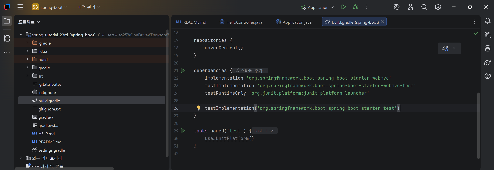

**3-2. Controller 에 대한 Test Class 를 추가**
* 경로: `\src\test\java\com\ceos23\spring_boot\HelloControllerTest.java`

```
// 패키지 선언
// 이 테스트 클래스가 속한 패키지를 의미한다.
package com.ceos23.spring_boot;

// 테스트에 사용할 JUnit 어노테이션
import org.junit.jupiter.api.DisplayName;
import org.junit.jupiter.api.Test;

// Spring Boot 테스트 환경을 구성하기 위한 어노테이션
import org.springframework.beans.factory.annotation.Autowired;
import org.springframework.boot.test.context.SpringBootTest;

// MockMvc 설정을 자동으로 구성하는 어노테이션
import org.springframework.boot.test.autoconfigure.web.servlet.AutoConfigureMockMvc;

// HTTP 요청을 테스트할 때 사용하는 객체
import org.springframework.test.web.servlet.MockMvc;

// HTTP GET 요청을 생성하기 위한 메서드
import static org.springframework.test.web.servlet.request.MockMvcRequestBuilders.get;

// 응답 상태코드를 검증하기 위한 메서드
import static org.springframework.test.web.servlet.result.MockMvcResultMatchers.status;


// @SpringBootTest
// 실제 Spring Boot 애플리케이션을 실행한 것과 동일한 환경에서 테스트를 수행한다.
// 즉, Spring 컨테이너를 띄우고 Bean들을 모두 로드한다.
@SpringBootTest

// @AutoConfigureMockMvc
// MockMvc 객체를 자동으로 설정해준다.
// MockMvc는 실제 서버를 실행하지 않고도 HTTP 요청을 테스트할 수 있게 해준다.
@AutoConfigureMockMvc
public class HelloControllerTest {

    // @Autowired
    // Spring 컨테이너에 있는 MockMvc Bean을 자동으로 주입받는다.
    @Autowired
    private MockMvc mvc;

    // @DisplayName
    // 테스트 이름을 사람이 읽기 쉬운 형태로 지정한다.
    @DisplayName("HelloController의 hello() 메서드 테스트")

    // @Test
    // 이 메서드가 테스트 코드임을 의미한다.
    @Test
    public void getHello() throws Exception{

        // MockMvc를 이용해 "/" 경로로 GET 요청을 보낸다.
        mvc.perform(get("/"))

                // 응답 상태 코드가 200 OK인지 확인
                .andExpect(status().isOk())

                // 응답 결과를 검증
                .andExpect(result -> {

                    // 서버가 반환한 응답 문자열을 가져온다.
                    String response = result.getResponse().getContentAsString();

                    // 응답 내용이 "Hello, Spring Boot!"인지 확인
                    assert response.equals("Hello, Spring Boot!");
                });
    }
}

```

- `HelloController`가 정상적으로 동작하는지 확인하는 테스트

- 테스트 흐름:
    - Spring Boot 테스트 환경 실행
    - MockMvc로 HTTP 요청 생성
    - / 경로로 GET 요청 전송
    - 응답 상태코드 확인 (200 OK)
    - 응답 내용 확인

- **핵심 개념**
    1. MockMvc
        - Spring에서 HTTP 요청을 테스트하기 위한 도구
        - 서버를 실제로 실행하지 않고도 컨트롤러 테스트 가능
    2. @SpringBootTest
        - Spring Boot 전체 애플리케이션 환경을 로드
        - 컨트롤러 / 서비스 / Bean 전부 로딩됨
    3. mvc.perform()
        - 테스트에서 HTTP 요청을 보내는 코드
        ```
        # / 경로로 GET 요청
        mvc.perform(get("/"))
        ``` 

**3-3. 결과 확인**
.png)


---

### 4. MySQL & Datagrip
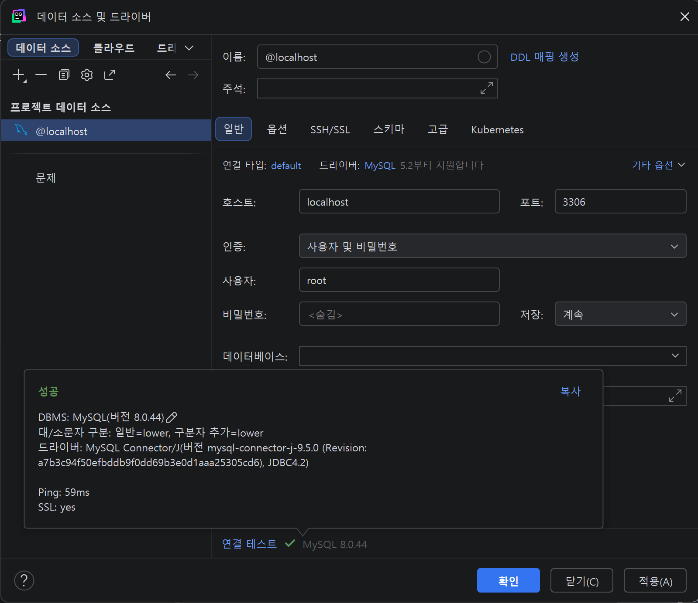

- Host : localhost
- Port : 3306
- User : root

---

### 5. dependencies 추가 -> build.gradle
```
dependencies {

    // Spring MVC 기반 웹 애플리케이션 개발을 위한 기본 의존성
    // Controller, REST API, Tomcat 내장 서버 등이 포함된다.
	implementation 'org.springframework.boot:spring-boot-starter-webmvc'

    // Spring MVC 관련 테스트를 위한 라이브러리
    // MockMvc 등을 사용하여 Controller 테스트를 할 수 있다.
	testImplementation 'org.springframework.boot:spring-boot-starter-webmvc-test'

    // JUnit 플랫폼에서 테스트를 실행하기 위한 런처
    // 테스트 실행 환경을 구성할 때 사용된다.
	testRuntimeOnly 'org.junit.platform:junit-platform-launcher'
	

	// ===== 새롭게 추가된 의존성 =====

    // Lombok 라이브러리
    // Getter, Setter, Constructor 등을 자동으로 생성해주는 라이브러리
    // 컴파일 시에만 필요하고 실제 실행 시에는 필요하지 않다.
	compileOnly 'org.projectlombok:lombok'

    // Lombok 어노테이션을 처리하기 위한 annotation processor
    // Lombok 코드 생성을 위해 필요하다.
	annotationProcessor 'org.projectlombok:lombok'

    // Spring Data JPA
    // 데이터베이스와 ORM(Object Relational Mapping)을 사용하기 위한 라이브러리
    // Entity, Repository 등을 이용해 DB 접근을 쉽게 할 수 있다.
	implementation 'org.springframework.boot:spring-boot-starter-data-jpa'

    // MySQL 데이터베이스 연결을 위한 JDBC 드라이버
    // Spring Boot 애플리케이션이 MySQL DB와 통신할 수 있게 해준다.
	runtimeOnly 'com.mysql:mysql-connector-j'

    // Spring Boot 테스트 라이브러리
    // JUnit, Mockito, Spring Test 등 다양한 테스트 도구가 포함되어 있다.
	testImplementation 'org.springframework.boot:spring-boot-starter-test'
}

```

- 각 의존성 역할 정리

    1. spring-boot-starter-webmvc
        - 웹 애플리케이션 개발용
        - 포함 기능
            - Spring MVC, REST API, DispatcherServlet, 내장 Tomcat 서버
        - *Controller + REST API 만들 때 필수*

    2. spring-boot-starter-webmvc-test
        - Spring MVC 테스트용
        - 주요 기능
            - MockMvc
            - Controller 테스트

    3. junit-platform-launcher
        - JUnit 테스트 실행을 위한 플랫폼 런처
        - 테스트 실행 환경을 제공

    4. Lombok
         - 코드 자동 생성 라이브러리

    5. spring-boot-starter-data-jpa
     - Spring에서 DB 접근을 쉽게 하는 라이브러리
     - 주요 기능
        - Entity
        - Repository
        - Hibernate ORM
        - JPQL
        - *Java 객체 ↔ DB 테이블* 매핑

    6. mysql-connector-j
        - MySQL 데이터베이스 연결 드라이버
        - Spring Boot가 MySQL 서버와 통신할 수 있게 함
        
    7. spring-boot-starter-test
        - Spring Boot 테스트 통합 패키지
        - *Spring 테스트 기본 패키지*

- dependencies 설정 => **Spring Boot 백엔드 기본 세팅**
```
웹 서버
+ REST API
+ DB(MySQL)
+ ORM(JPA)
+ Lombok
+ 테스트 환경
```

---

### 6. application.yaml 작성

**6-1. 파일 이름 변경 : `application.properties` → `application.yaml`**

**6-2. src/main/resources/application.yaml**
```
spring:
  datasource:
    url: jdbc:mysql://localhost:3306/test_db?allowPublicKeyRetrieval=true&useSSL=false&characterEncoding=UTF-8
    username: root
    password: 2562
    driver-class-name: com.mysql.cj.jdbc.Driver

  jpa:
    hibernate:
      ddl-auto: create
    show-sql: true
    properties:
      hibernate:
        format_sql: true

logging:
  level:
    org.hibernate.SQL: debug
```

- 설정 의미
    - Spring Boot 실행 시
    **Spring Boot -> MySQL localhost:3306 -> test_db 연결 **
    - **ddl-auto: create**
    


---

### 7. Domain, Repository, Service, Controller 를 작성

**7-1. src/main/java/Test.java**
* 경로 : `src\main\java\com\ceos23\spring_boot\Test.java`

```
package com.ceos23.spring_boot;

import jakarta.persistence.Entity;
import jakarta.persistence.Id;
import lombok.Data;

@Data
@Entity
public class Test {

    @Id
    private Long id;
    private String name;
}
```

**7-2. src/main/java/TestRepository.java**
* 경로 : `src\main\java\com\ceos23\spring_boot\TestRepository.java`

```
package com.ceos23.spring_boot;

import org.springframework.data.jpa.repository.JpaRepository;

public interface TestRepository extends JpaRepository<Test, Long> {
}
```

**7-3. src/main/java/TestService.java**
* 경로 : `src\main\java\com\ceos23\spring_boot\TestService.java`

```
package com.ceos23.spring_boot;

import lombok.RequiredArgsConstructor;
import org.springframework.stereotype.Service;
import org.springframework.transaction.annotation.Transactional;

import java.util.List;

@Service
@RequiredArgsConstructor
public class TestService {

    private final TestRepository testRepository;

    @Transactional(readOnly = true)
    public List<Test> findAllTests() {
        return testRepository.findAll();
    }
}
```

**7-4. src/main/java/TestController.java**
* 경로 : `src\main\java\com\ceos23\spring_boot\TestController.java`

```
package com.ceos23.spring_boot;

import lombok.RequiredArgsConstructor;
import org.springframework.web.bind.annotation.GetMapping;
import org.springframework.web.bind.annotation.RequestMapping;
import org.springframework.web.bind.annotation.RestController;

import java.util.List;

@RestController
@RequiredArgsConstructor
@RequestMapping("/tests")
public class TestController {

    private final TestService testService;

    @GetMapping
    public List<Test> findAllTests() {
        return testService.findAllTests();
    }
}
```

---

### 8. 서버 실행, DataGrip에서 데이터추가 후 API 요청 결과 확인
.png)
.png)

</details>

<details>
<summary><h2> 2️⃣ spring이 지원하는 기술들(IoC/DI, AOP, PSA 등)을 자유롭게 조사해요 </summary>

### 1. IoC / DI, AOP, PSA

**Spring**
> **자바 엔터프라이즈 애플리케이션 개발을 편하게 하기 위해 만들어진 오픈소스 경량 애플리케이션 프레임워크**

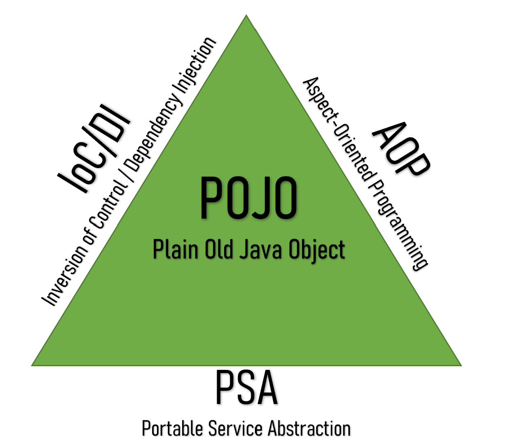
**Spring Triangle**
- Spring 핵심 철학 : **POJO 기반 개발**
    - POJO
        - 생성과 의존성 관리를 Spring이 담당
        - 순수 자바 객체 기반 개발
    - IoC / DI (제어의 역전 / 의존성 주입)
        - 특정 프레임워크에 강하게 의존하지 않는 구조
    - AOP (Aspect Oriented Programming)
        - 공통 기능을 분리하여 모듈화
    - PSA (Portable Service Abstraction)
        - 다양한 기술을 하나의 방식으로 사용할 수 있게 추상화

---

### 2. IoC(Inversion of Control)
> **객체 생성과 제어권을 개발자가 아닌 프레임워크가 관리하는 구조**

- 기존 방식
```
개발자가 객체 생성
→ 객체 관리
→ 의존성 관리

```

- Spring 방식
```
Spring Container
→ 객체 생성
→ 객체 관리
→ 의존성 연결
```

- IoC 컨테이너 역할
    - Bean 생성 및 관리
    - 객체 의존성 연결
    - 객체 라이프사이클 관리
    - 설정 관리

- IoC **문제** 예시 코드
```
// 일반적인 자바 방식
public class Car {

Tiretire;

publicCar() {
tire=newKoreaTire();
// 문제: Car 클래스가 KoreaTire 구현체에 강하게 의존
    }
}
```
- 다른 타이어로 변경하려면 코드 수정 필요
- 테스트 객체 주입 어려움
- 결합도 증가

---

### 3. DI (Dependency Injection)
> **IoC를 구현하는 방법 중 하나, 필요한 객체를 외부에서 주입받는 방식**
```
객체 내부에서 new 생성 ❌
외부에서 객체 주입 ⭕
```

- DI 방식
    1. 생성자 주입 (권장)
    ```
    @Service
    public class CarService {

    privatefinalTiretire;

    // 생성자를 통해 의존성 주입
    publicCarService(Tiretire) {
    this.tire=tire;
        }
    }

    ```
    - 장점
        - 필수 의존성 보장
        - 테스트 용이
        - 불변 객체 유지 가능

    2. 필드 주입
    ```
    @Service
    public class CarService {

        @Autowired
    Tiretire;
    // 스프링이 자동으로 의존성 주입
    }

    ```
    - 단점
        - 테스트 어려움
        - 의존성 숨겨짐
    
    3. Setter 주입
    ```
    @Service
    public class CarService {

    privateTiretire;

        @Autowired
    publicvoidsetTire(Tiretire) {
    this.tire=tire;
        }
    }

    ```
    - 장점
        - 선택적 의존성 처리 가능

---

### 4. AOP (Aspect Oriented Programming)
> **핵심 로직과 공통 기능을 분리하는 프로그래밍 방식**

- AOP 동작 구조
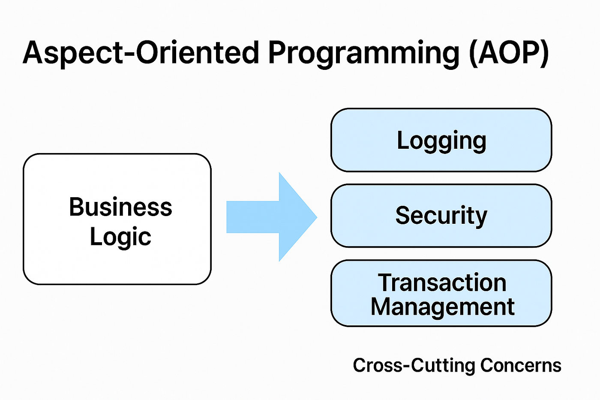
- 비즈니스 로직 여러 곳에서 반복되는 로그 / 트랜잭션 같은 공통 기능을 하나의 Aspect로 분리하여 적용

- AOP 주요 개념

| 개념 | 설명 |
| --- | --- |
| Aspect | 공통 기능 모듈 |
| Advice | 실제 실행될 코드 |
| Pointcut | 적용 위치 |
| Join Point | 실행 지점 |

- AOP 실행 시점 : Spring에서는 아래 같은 위치에 코드 삽입 가능
    - Before
    - After
    - AfterReturning
    - AfterThrowing
    - Around

- AOP 예제 코드
```
@Service
public class MemberService {

publicvoidjoin(Stringname) {
System.out.println(name+" 회원 가입");
    }
}

# Aspect 코드
@Aspect
@Component
public class LoggingAspect {

// MemberService의 모든 메서드 실행 전에 실행
    @Before("execution(* com.example.service.MemberService.*(..))")
publicvoidlogBefore() {

// 공통 로직 (로그)
System.out.println("[LOG] 서비스 메서드 실행 시작");

    }
}
```
    - 설명
        - `@Aspect` → AOP 클래스 선언
        - `@Before` → 메서드 실행 전 실행
        - `execution()` → 적용 범위 지정

- AOP 실제 활용 예시 *윤지님께서 찾아보라고 권장해주신 부분*
    - `@ControllerAdvice` : 전역 예외 처리
    ```
    @ControllerAdvice
    public class GlobalExceptionHandler {

        @ExceptionHandler(Exception.class)
    publicStringhandleException() {
    return"error";
        }
    }
    ```

    - `@Transactional` : 트랜잭션 관리
    ```
    @Transactional
    publicvoidsaveUser(Useruser){
    userRepository.save(user);
    }
    ```

    - `@Cacheable` : 메서드 결과 캐싱
    ```
    @Cacheable("users")
    publicUsergetUser(Longid){
    returnrepository.findById(id);
    }
    ```

    - `@PreAuthorize` : 메서드 실행 전 권한 체크
    ```
    @PreAuthorize("hasRole('ADMIN')")
    publicvoiddeleteUser(Longid){
    }

    ```

    - `@Valid` : 요청 데이터 검증
    ```
    publicResponseEntitycreateUser(@ValidUserDtodto){
    }
    ```

    - `@Async` : 비동기 처리
    ```
    @Async
    publicvoidsendEmail(){
    }

    ```

    - `@Retryable` : 실패 시 자동 재시도
    ```
    @Retryable(value=Exception.class,maxAttempts=3)
    publicvoidcallApi(){
    }

    ```

---

> **🟡 좀 더 고민하기**

### 5. PSA (Portable Service Abstraction)
> **여러 기술을 동일한 방식으로 사용할 수 있도록 추상화한 것**

- DB가 JDBC든, JPA든, Hibernate든...
- 개발자는 **@Transactional만 사용하면 된다!!**
- **Spring이 내부적으로 기술을 연결**

- 대표 예시 : @Transactional
```
@Service
@RequiredArgsConstructor
public class MemberService {

privatefinalMemberRepositorymemberRepository;

    @Transactional
publicvoidjoin(Membermember) {

// DB 저장
memberRepository.save(member);

    }
}
```

---

### 6. 정리 
- Spring 의 핵심 기술
> **유지 보수성 향상, 코드 재사용성 증가, 테스트 용이성 확보**

| 기술 | 역할 |
| --- | --- |
| IoC / DI | 객체 생성과 의존성 관리 |
| AOP | 공통 기능 분리 |
| PSA | 다양한 기술을 동일 방식으로 사용 |

</details>

<details>
<summary><h2> 3️⃣ Spring Bean 이 무엇이고, Bean 의 라이프사이클과 Bean Scope에 대해 조사해요 </summary>

### 1. Spring Bean이란 무엇인가
> **스프링 컨테이너가 생성하고 관리하는 객체**

- 일반적이 자바 프로그램 : 개발자가 직접 `new` 키워드로 객체 생성
- 스프링 : 객체 생성과 관리가 컨테이너에 의해 이루어짐

- 스프링 컨테이너의 역할
    - Bean 생성
    - Bean 의존성 주입
    - Bean 라이프사이클 관리
    - Bean 설정 관리

---

### 2. Spring Bean 등록 방식
**1. 어노테이션 기반 등록**
- 가장 많이 사용되는 방식

- 대표 어노테이션
    - `@Component`
    - `@Service`
    - `@Repository`
    - `@Controller`
    - `@RestController`

- 예제 코드
```
// @Service 어노테이션이 붙은 클래스를 스프링이 자동으로 탐지한다.
//해당 클래스는 Bean으로 등록되어 다른 객체에서 사용할 수 있게 된다.

packagecom.example.service;

importorg.springframework.stereotype.Service;

@Service
public class StudentService {

// 이 클래스는 스프링 컨테이너에 Bean으로 등록된다.

publicvoidprintStudent() {
System.out.println("학생 서비스 실행");
    }
}
```

**2. JAVA Config 기반 등록 -> @Bean**
- 설정 클래스에서 직접 Bean 등록
- 객체 생성 방식을 세밀하게 제어할 때 사용

```
// @Configuration : 설정 클래스
// @Bean : 반환 객체를 Spring Bean으로 등록

@Configuration
publicclassAppConfig {

    @Bean
publicStudentServicestudentService() {

// 직접 객체 생성
returnnewStudentService();
    }
}
```

---

### 3. Bean 라이프사이클 (Bean Lifecycle)

- Bean 라이프사이클 단계
    1. Bean Definition 생성
    2. Bean 객체 생성
    3. 의존성 주입 (DI)
    4. 초기화 메서드 실행
    5. 애플리케이션에서 사용
    6. 컨테이너 종료 시 Bean 소멸

- 예제
```
packagecom.example.lifecycle;

importjakarta.annotation.PostConstruct;
importjakarta.annotation.PreDestroy;
importorg.springframework.stereotype.Component;

@Component
publicclassLifeCycleBean {

// 1. Bean 생성 시점
publicLifeCycleBean() {
System.out.println("Bean 생성자 호출");
    }

// 2. 의존성 주입 후 실행되는 초기화 메서드
    @PostConstruct          // → Bean 생성 및 의존성 주입 이후 실행
publicvoidinit() {
System.out.println("Bean초기화 메서드 실행");
    }

// 3. 컨테이너 종료 직전에 실행되는 메서드
    @PreDestroy             // → 애플리케이션 종료 시 실행
publicvoiddestroy() {
System.out.println("Bean 소멸 메서드 실행");
    }
}
```

---

### 4. Bean Scope
>**Bean이 생성되는 범위와 생존 범위를 정의하는 개념**

- singleton (기본 스코프) : spring의 기본 Scope
    - 특징
        - 컨테이너당 하나의 Bean만 생성
        - 모든 곳에서 같은 객체 공유
    *※ 기본값이므로 보통 생략*
    ```
    @Component
    @Scope("singleton")
    publicclassSingletonBean {
    }
    ```

- prototype : 요청할 때마다 새로운 Bean 생성
    - 특징
        - 호출할 때마다 새로운 객체 생성
        - 상태가 매번 달라야 하는 객체에 사용
    ```
    @Component
    @Scope("prototype")
    publicclassPrototypeBean {
    }

    ```

- 웹 환경 Scope
| Scope | 설명 |
| --- | --- |
| request | HTTP 요청마다 새로운 Bean 생성 |
| session | HTTP 세션마다 새로운 Bean 생성 |
| application | 애플리케이션 범위에서 하나 |

---

### 5. 어노테이션이란 무엇인가
> **코드에 추가적인 정보를 제공하는 메타데이터**
> 코드 동작을 직접 바꾸는 것 X , 프레임워크나 컴파일러에게 정보 제공
```
@Service
publicclassUserService {
}
```
    - @Service
        - "이 클래스는 서비스 계층이다", "Spring Bean으로 등록해야 한다" 라고 Spring한테 전달

- Java에서 어노테이션 구현 방식
    - **특수한 인터페이스 형태로 정의**
    ```
    importjava.lang.annotation.Retention;
    importjava.lang.annotation.RetentionPolicy;

    @Retention(RetentionPolicy.RUNTIME)
    public @interfaceMyAnnotation {

    Stringvalue()default"";

    }
    ```
    - `@interface` → 어노테이션 선언
    - `RetentionPolicy.RUNTIME` → 실행 중에도 읽을 수 있도록 설정

---

### 6. Spring에서 어노테이션으로 Bean 등록 시 과정
(Spring Boot 애플리케이션 실행 시 내부적으로 아래와 같은 과정 발생)
- 전체 흐름
    1. 애플리케이션 실행
    2. `@SpringBootApplication` 인식
    3. `@ComponentScan` 실행
    4. 패키지 스캔
    5. `@Component`, `@Service`, `@Repository` 등 발견
    6. BeanDefinition 생성
    7. Spring Container에 등록
    8. Bean 생성 및 의존성 주입
    9. Bean 초기화

---

### 7. `@ComponentScan` 동작 과정
> **`@ComponentScan`은 패키지를 탐색하여 Bean 후보를 찾는 기능**

- 탐색 범위
    - 메인 애플리케이션 클래스가 위치한 패키지부터 하위 패키지 탐색
    ```
    // 스캔 대상 : com.example.*
    
    packagecom.example;

    @SpringBootApplication
    publicclassApplication {
    }
    ```

- 내부 동작 과정 
    **(처음에는 객체를 생성하지 않고 Bean 정의만 등록한다는 것)**
    1. ClassPath 탐색
    2. `.class` 파일 메타데이터 분석
    3. 어노테이션 존재 여부 확인
    4. BeanDefinition 생성
    5. BeanFactory 등록

---
> **🟡 좀 더 고민하기**

### 8. Interface 구현체가 여러 개 있을 때 주입 방법
- 인터페이스를 구현한 Bean이 여러 개 있으면 Spring이 어떤 Bean을 주입해야 할지 결정할 수 없다!
```
publicinterfacePaymentService {

voidpay();

}

```

- 구현체
```
@Service
publicclassTossServiceimplementsPaymentService {

    @Override
publicvoidpay() {
System.out.println("토스페이 결제");
    }

}

```

```
@Service
publicclassNaverPayServiceimplementsPaymentService {

    @Override
publicvoidpay() {
System.out.println("네이버페이 결제");
    }

}
```
- 구현 방법
    - `@Primary` : 기본 Bean을 지정하는 방식
        ```
        @Primary
        @Service
        publicclassKakaoPayServiceimplementsPaymentService {
        }

        ```
    
    - `List 주입` : 모든 구현체를 한 번에 주입
        ```
        @Service
        publicclassPaymentManager {

        privatefinalList<PaymentService>paymentServices;

        publicPaymentManager(List<PaymentService>paymentServices) {

        // 모든 PaymentService 구현체가 리스트로 주입됨
        this.paymentServices=paymentServices;

            }
        }

        ```

---

### 정리해보기

- Spring Bean
    - **Spring Container가 생성하고 관리하는 객체**

- Bean
    - 생성, 의존성 주입, 초기화, 사용, 소멸의 **라이프사이클**을 가짐

- Bean Scope를 통해 객체의 생성 범위를 정의 가능
    - 대표적 :  `singleton`과 `prototype`

- Spring
    - 어노테이션 기반 컴포넌트 스캔 ->  Bean을 자동으로 탐색하고 등록
    - 객체 관리와 의존성 연결을 자동화
    - **유지보수성과 확장성이 높은 애플리케이션 구조 제공.**


</details>

<details>
<summary><h2> 4️⃣🔥Spring MVC를 심층 분석해요🔥</summary>

### 1. MVC 패턴과 Spring MVC는 어떻게 다를까
- 전통적인 MVC 패턴 : *역할 분리* 자체가 핵심
    - 화면 코드와 비즈니스 로직을 섞지 않고 나눔
    - **Model**
        - 데이터와 비즈니스 로직 담당
    - **View**
        - 사용자에게 보여지는 화면 담당
    - **Controller**
        - 요청을 받아 Model과 View를 연결

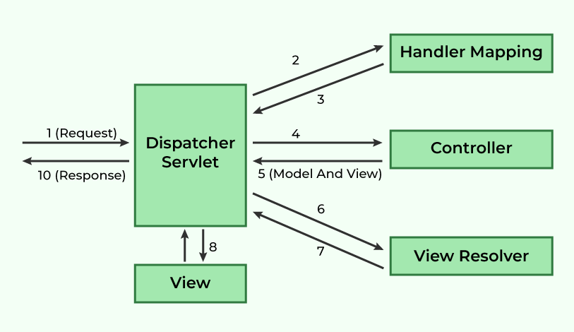
- Spring MVC
    - 웹 요청을 처리하기 위해 실행 구조까지 프레임워크가 제공하는 MVC
    - `DispatcherServlet` : 공통 알고리즘 담당
    - `각각의 위임 컴포넌트` : 실제 라우팅, 핸들러 호출, 예외 처리, 뷰 해석

- 정리

| 구분 | 특징 |
| --- | --- |
| **MVC 패턴** | 역할 분리 개념 |
| **Spring MVC** | 역할 분리를 실제 웹 애플리케이션에서 동작하게 만드는 구현 프레임워크 |

> **전통 MVC가 `설계 원칙`이라면**
> **Spring MVC는 그 설계 원칙을 웹 요청 흐름까지 포함해서 자동화한 프레임워크**

---

### 2. Servlet은 무엇이고 웹 요청은 어떻게 처리될까

- **Servlet : 자바로 만든 웹 요청 처리 컴포넌트**

- 웹 요청 처리 기본 흐름
    1. 클라이언트가 HTTP 요청 전송
    2. 톰캣 같은 서블릿 컨테이너가 요청 수신
    3. 매핑된 Servlet 실행
    4. Servlet이 비즈니스 로직 호출
    5. 응답 생성 후 브라우저로 반환

- Servlet 라이프사이클
    - `init()` : 최초 한 번 초기화
    - `service()` : 요청마다 호출
    - `destroy()` : 종료 직전 호출

---

### 3. 톰캣이 무엇이고 WAS는 무엇일까

- **WAS(Web Application Server)**
    - **정적인 파일만 보내는 서버를 넘어서 애플리케이션 로직을 실행해서 동적인 응답을 만들어주는 서버 환경**
    - 자바 코드 실행, 서블릿/JSP 처리, DB 연동 등 동적 처리 가능

*(cf. 웹 서버 : HTML, CSS, JS, 이미지 같은 정적 자원 응답에 강함)*

> **🟡 좀 더 고민하기**
- **톰캣(Apache Tomcat)**
    - **Jakarta Servlet 등의 명세를 구현한 오픈소스 서블릿 컨테이너**
    - 자바 웹 애플리케이션을 실행해주는 환경
    - Spring Boot에서는 내장 톰캣이 함께 실행
    - 요청을 받아 적절한 서블릿으로 전달

> **🟡 좀 더 고민하기**
- 톰캣과 Spring Boot
    - `main()` 실행 시
        - Spring Boot 시작
        - 내장 톰캣 시작
        - `DispatcherServlet` 등록
        -  요청 대기

---

### 4. DispatcherServlet은 무엇인가
> **Spring MVC의 중앙 프론트 컨트롤러(Front Controller)**

- 역할
    - 요청을 제일 먼저 받음
    - 어떤 컨트롤러가 처리할지 찾음
    - 적절한 어댑터를 통해 컨트롤러 메서드 호출
    - 예외 처리, 뷰 처리까지 전체 흐름 조정

- 필요한 이유
    - 만약 `DispatcherServlet` 가 없다면??
        - URL 매핑
        - 예외 처리
        - 뷰 반환
        - 인터셉터 처리
    *모두 다 따로 관리해야 한다..*

    - `DispatcherServlet` 로 중앙에서 한 번에 처리한다면?
        - 구조가 일관됨
        - 확장 포인트가 명확함
        - 공통 처리 적용이 쉬움

---

> **🟡 좀 더 고민하기**
> *[https://mangkyu.tistory.com/216](https://mangkyu.tistory.com/216)*

### 5. DispatcherServlet 동작 흐름 분석

- `DispatcherServlet`의 요청 처리 핵심 흐름
    1. 요청 전처리
    2. 핸들러 조회
    3. 핸들러 어댑터 조회
    4. 컨트롤러 호출
    5. 후처리
    6. 결과 렌더링
    7. 예외 처리 및 완료 처리

- `doDispatch()` 기준 상세한 흐름
    - `checkMultipart(request)`
        - 파일 업로드 요청인지 확인
        - 필요 시 multipart 요청으로 가공

    - `getHandler(processedRequest)`
        - 요청 URL에 맞는 핸들러 찾음
        - `HandlerMapping` 목록 순회 -> `HandlerExecutionChain` 찾음
    
    - `HandlerExecutionChain`
        -  핸들러 + 인터셉터들이 함께 있음
    
    - `getHandlerAdapter(mappedHandler.getHandler())`
        - 핸들러로 실제 실행 가능한 `HandlerAdapter` 을 찾음
    
    - `ha.handle(...)`
        - 실제로 컨트롤러 메서드 호출
    
    - `ModelAndView` 반환
        - 컨트롤러 실행 결과를 `ModelAndView`로 받음
    
    - `processDispatchResult(...)`
        - 예외가 있으면 `HandlerExceptionResolver`를 통해 처리
        - 정상이라면 뷰를 렌더링

- 코드 흐름 (브라우저에서 /tests 요청이 들어올 때)

```
브라우저 요청
→ 톰캣이 요청 수신
→ DispatcherServlet 실행
→ HandlerMapping이 TestController.findAllTests() 찾음
→ HandlerAdapter가 메서드 호출
→ Service/Repository 실행
→ 결과 반환
→ JSON 또는 View 응답 생성
→ 브라우저 응답
```

---

### 7. Spring MVC에서 자주 등장하는 핵심 구성요소
(DispatcherServlet이 자주 사용하는 핵심 위임 객체)

    - **HandlerMapping**
        - 어떤 요청을 어떤 핸들러가 처리할지 찾음
    - **HandlerAdapter**
        - 찾은 핸들러를 실제 실행
    - **HandlerExceptionResolver**
        - 예외 처리
    - **ViewResolver**
        - 뷰 이름을 실제 View 객체로 해석
    - **MultipartResolver**
        - 파일 업로드 처리
    - **LocaleResolver**
        - 지역화 정보 처리


---

### 8. 정리해보기

- **Servlet vs DispatcherServlet**

| 구분 | 특징 |
| --- | --- |
| **Servlet** | 자바 웹 요청 처리의 기본 단위 |
| **DispatcherServlet** | Spring MVC에서 모든 요청을 모아 처리하는 중앙 Servlet |

- **톰캣 vs Spring**

| 구분 | 특징 |
| --- | --- |
| **톰캣** | 서블릿을 실행해주는 컨테이너 |
| **Spring MVC** | 톰캣 위에서 동작하는 웹 프레임워크 |

- **`doDispatch()`의 핵심**
    - 요청 직접 처리하기 보단..
    - *누가, 어떻게 실행, 결과를 어떻게 응답할지* 하는 메서드


</details>

<details>
<summary><h2> 5️⃣ CGV DB를 모델링해봐요!</summary>

> **🟡 이 파트는 전체적으로 좀 더 고민하기**

### 1. 설계 아이디어
- 좌석을 상영관마다 직접 다 만들지 않는 것
- **영화관 종류별 좌석 템플릿***으로 분리...?
    - 일반관 : 8x10
    - IMAX : 10x15
- 예매 : 상영 기준으로 관리
    - 같은 영화라도 시간대가 다르면 다른 예매!!
    - movie에 직접 예매를 붙이지 않기
    - screening에 붙이기

### 2. 요구사항 -> 엔티티
- **영화관 조회** : `theater`
    
- **영화관 찜** : `user_theater_like`
    
- **영화 조회** : `movie`
    
- **영화 예매, 취소** : `screening`, `booking`, `booking_seat`
    
- **영화 찜** : `user_movie_like`
    
- **매점 구매** : `store_menu`, `theater_store_stock`, `store_order`, `store_order_item`

- **특별관과 일반관** : `auditorium`에 관 종류(`auditorium_type`) 필요
    
- **관 종류별 좌석** : `seat_layout_template`, `seat_template`으로 분리
    
- **좌석** : 행/열(`row_no`, `col_no`)로 관리
    
- **영화관마다 매점 따로** : `theater_store_stock`
    
- **영화관 매점 메뉴 동일** : 메뉴 마스터는 하나(`store_menu`)
    - 재고만 영화관별로 분리

### 4. 엔티디
- **회원**
    - `user` : 회원 정보
    - `user_movie_like` : 회원별 관심 영화
    - `user_theater_like` : 회원별 자주 가는 영화관

- **영화**
    - `movie` : 영화 기본 정보

- **영화관**
    - `theater` : 영화관 지점 -> 대전 둔산점, 대전 관저점
    - `auditorium` : 실제 각 영화관 내부 상영관 -> 둔산점 아이맥스관
    - `auditorium_type` : 관 종류 -> 아이맥스 , 스크린X, 3D 같은거
    - `seat_layout_template` : 관 종류 별 좌석 배치 템플릿
    - `seat_template` : 실제 좌석표 -> A열 1번, 2번 같은거

- **상영/예매**

    - `screening` : 특정 시간에 상영되는 정보
    - `booking` : 예매
    - `booking_seat` : 예매 좌석 -> 여러 개 가능!

- **매점**

    - `store_menu` : CGV 모든 지점의 공통 매점 메뉴
    - `theater_store_stock` : 관별 메뉴 재고
    - `store_order` : 주문
    - `store_order_item` : 주문 상세 정보

### 5. ERD 그려보기
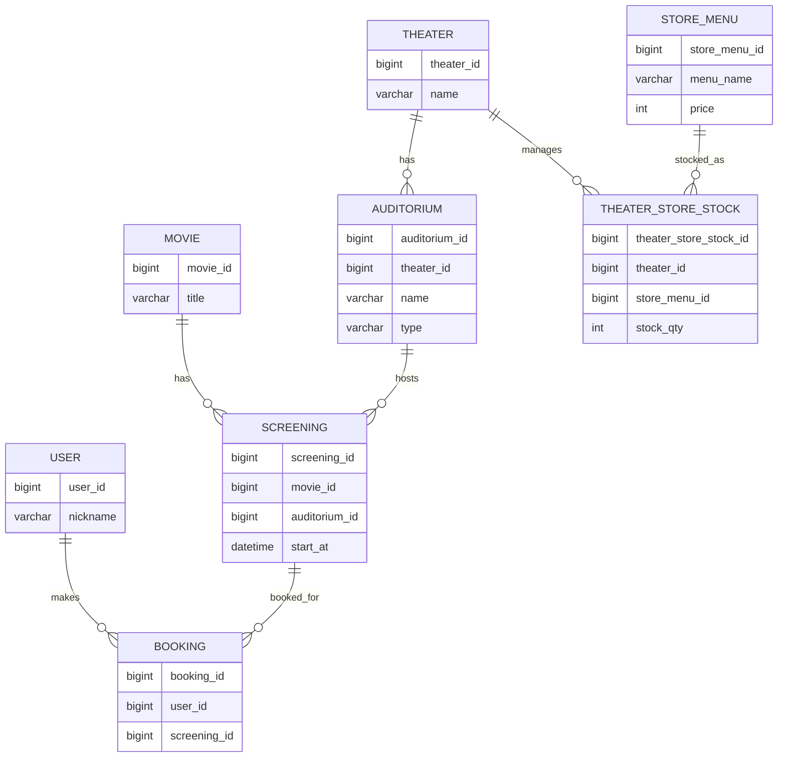

### 6. 더 고민해보고 싶은 것
- 조금 더 디테일하게 들어가서
    - 영화 장르, 쿠폰... 같은 것도 할 수 있을 듯 ... 에효

</details>

<details>
<summary><h3> 아쉬운 점 및 계획 </h3></summary>

- Python 기반으로 FastAPI를 사용한 백엔드 개발을 주로 경험하다 보니
- Spring의 구조와 개념을 한 번에 이해하기는 쉽지 않았음...

- 웹 요청이 DispatcherServlet을 중심으로 처리되는 흐름은 코드만 보고 바로 이해하기에는 아직 부족함..

- CGV DB 모델링 : 요구사항을 엔티티와 관계로 설계하는 과정이 생각보다 쉽지 않음..
    - 실제 서비스 수준의 데이터 모델링을 하기 위해 더 많은 연습하기

- 좀 더 고민할 것들
    - **Spring Boot 내부 동작 구조 이해**
        - Bean 생성 과정
        - Spring Container의 동작 흐름을 코드 레벨에서 더 깊게 이해하기
    - **Spring 계층 구조 설계**
        - Controller / Service / Repository 계층을 실제 서비스 구조에 맞게 설계하기
    - **DB 모델링 개선**
        - 실제 서비스 상황을 더 세밀하게 반영하기

</details>